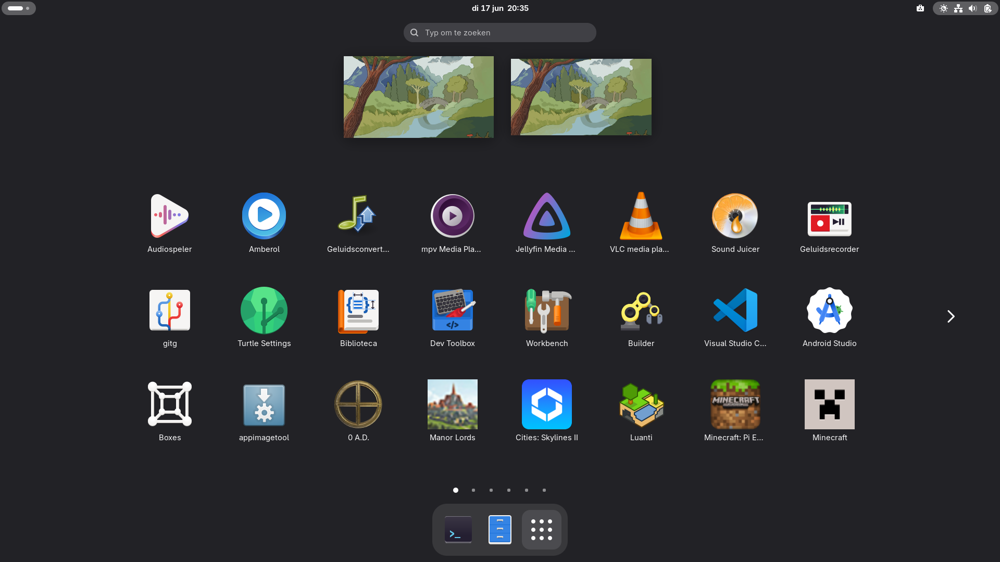

# Category sorted App Grid

Sorts the GNOME Overview app grid by category.

## Development

The extension is split into small ES modules:

- `extension.js` is the GNOME Shell extension entrypoint.
- `categoryGridSorter.js` coordinates sorting, cleanup, and helper modules.
- `appDisplayPatches.js` owns AppDisplay monkey patches and fallback behavior.
- `redisplayQueue.js` owns coalesced redisplay scheduling and retry handling.
- `shellSignals.js` owns Shell signal and folder settings listeners.
- `categorySorting.js` owns category extraction and ordering.
- `logging.js` owns debug and warning helpers.

## Manual test checklist

After changing runtime behavior, test in a GNOME Shell session:

- Enable and disable the extension repeatedly.
- Open and close the app grid repeatedly.
- Drag apps in the app grid.
- Add and remove favorite apps.
- Create, rename, and remove app folders.
- Install or remove an application and reopen the app grid.
- Check Shell logs for concise `CategorySortedAppGrid` warnings and no repeated exceptions.
